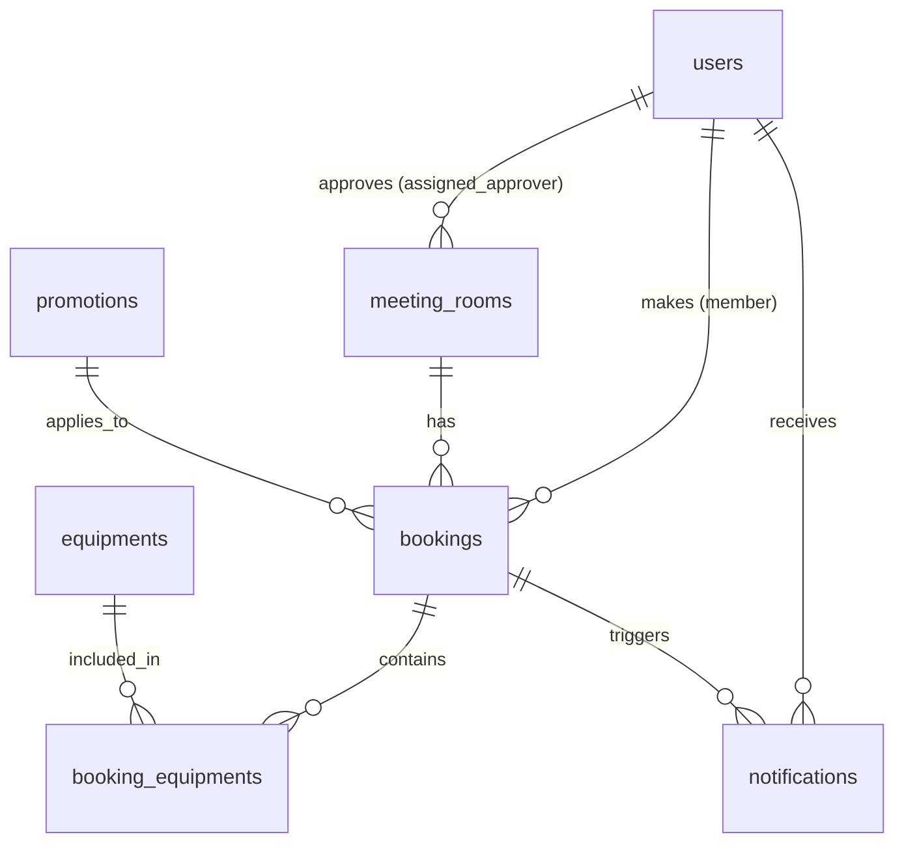

# Architecture Design & Detailed Database Schema

## 1. ภาพรวมสถาปัตยกรรมระบบ (System Architecture)

```
[ Frontend: HTML5 / CSS3 / Vanilla JS (Light & Dark Theme Toggle) ]
                               │
                               ▼  (REST API / JSON via HTTP)
[ Backend: Python FastAPI (Uvicorn Async Web Server) ]
       │                       │
       ▼ (SQLAlchemy ORM)      ▼ (Background Tasks / Notification)
[ Database: PostgreSQL ]   [ In-App Notifications & File Exports ]
```

---

## 2. แผงภาพความสัมพันธ์ระหว่างตาราง (Entity Relationship Diagram - ERD)



---

## 3. รายละเอียดตารางฐานข้อมูลและความสัมพันธ์ (Detailed Table Specifications)

### 3.1 ตาราง `users` (ตารางผู้ใช้งานและสมาชิก)
เก็บข้อมูลผู้ใช้งาน ผู้ดูแลระบบ (Admin), ผู้ดูแลห้อง (Room Manager) และสมาชิก (Member)
| Column Name | Data Type | Constraints | Description |
| :--- | :--- | :--- | :--- |
| `id` | SERIAL | Primary Key | รหัสประจำตัวผู้ใช้งาน |
| `email` | VARCHAR(255) | UNIQUE, NOT NULL, INDEX | อีเมลเข้าใช้งาน |
| `hashed_password` | VARCHAR(255) | NOT NULL | รหัสผ่านที่ผ่านการ Hash (Bcrypt) |
| `full_name` | VARCHAR(255) | NOT NULL | ชื่อ-นามสกุล |
| `phone` | VARCHAR(50) | NULLABLE | เบอร์โทรศัพท์ |
| `role` | VARCHAR(50) | NOT NULL, DEFAULT 'member' | สิทธิ์: `admin`, `room_manager`, `member` |
| `is_active` | BOOLEAN | NOT NULL, DEFAULT TRUE | สถานะบัญชี |
| `created_at` | TIMESTAMP | DEFAULT CURRENT_TIMESTAMP | วันเวลาที่สร้างบัญชี |

---

### 3.2 ตาราง `meeting_rooms` (ตารางห้องประชุม)
เก็บรายละเอียดข้อมูลห้องประชุม ราคามาตรฐาน/สมาชิก และผู้อนุมัติประจำห้อง
| Column Name | Data Type | Constraints | Description |
| :--- | :--- | :--- | :--- |
| `id` | SERIAL | Primary Key | รหัสห้องประชุม |
| `name` | VARCHAR(255) | NOT NULL | ชื่อห้องประชุม |
| `location` | VARCHAR(255) | NOT NULL | สถานที่ตั้ง / ชั้น |
| `capacity` | INTEGER | NOT NULL | ความจุผู้เข้าร่วม (คน) |
| `description` | TEXT | NULLABLE | รายละเอียดห้องประชุม |
| `status` | VARCHAR(50) | DEFAULT 'available' | สถานะ: `available`, `maintenance`, `booked` |
| `standard_price` | NUMERIC(10,2) | NOT NULL, DEFAULT 0.00 | ราคาสำหรับบุคคลทั่วไป (บาท/ชั่วโมง) |
| `member_price` | NUMERIC(10,2) | NOT NULL, DEFAULT 0.00 | ราคาส่วนลดสมาชิก (บาท/ชั่วโมง) |
| `requires_approval` | BOOLEAN | DEFAULT FALSE | ธงระบุว่าต้องรออนุมัติหรือไม่ |
| `assigned_approver_id` | INTEGER | FK -> `users(id)`, NULLABLE | ผู้อนุมัติที่ได้รับมอบหมายประจำห้อง |
| `image_url` | VARCHAR(500) | NULLABLE | รูปภาพห้องประชุม |
| `created_at` | TIMESTAMP | DEFAULT CURRENT_TIMESTAMP | วันเวลาที่เพิ่มข้อมูลห้อง |

---

### 3.3 ตาราง `equipments` (ตารางอุปกรณ์เสริม)
เก็บรายการอุปกรณ์เสริม จำนวนคลังคงเหลือ และราคาค่าบริการเพิ่มเติม
| Column Name | Data Type | Constraints | Description |
| :--- | :--- | :--- | :--- |
| `id` | SERIAL | Primary Key | รหัสอุปกรณ์ |
| `name` | VARCHAR(255) | NOT NULL | ชื่ออุปกรณ์ |
| `description` | TEXT | NULLABLE | รายละเอียดอุปกรณ์ |
| `total_quantity` | INTEGER | NOT NULL, DEFAULT 1 | จำนวนอุปกรณ์ทั้งหมดในคลัง |
| `available_quantity` | INTEGER | NOT NULL, DEFAULT 1 | จำนวนอุปกรณ์พร้อมใช้งานคงเหลือ |
| `standard_price` | NUMERIC(10,2) | NOT NULL, DEFAULT 0.00 | ราคาเช่าเสริมบุคคลทั่วไป (บาท/ชิ้น) |
| `member_price` | NUMERIC(10,2) | NOT NULL, DEFAULT 0.00 | ราคาเช่าเสริมสมาชิก (บาท/ชิ้น) |
| `created_at` | TIMESTAMP | DEFAULT CURRENT_TIMESTAMP | วันเวลาที่เพิ่มอุปกรณ์ |

---

### 3.4 ตาราง `promotions` (ตารางโปรโมชั่นและรหัสส่วนลด)
เก็บรหัสคูปองส่วนลด เปอร์เซ็นต์/จำนวนเงินลด และระยะเวลาใช้งาน
| Column Name | Data Type | Constraints | Description |
| :--- | :--- | :--- | :--- |
| `id` | SERIAL | Primary Key | รหัสโปรโมชั่น |
| `code` | VARCHAR(50) | UNIQUE, NOT NULL, INDEX | รหัสส่วนลด (เช่น `ROOMIE2026`) |
| `description` | TEXT | NULLABLE | รายละเอียดโปรโมชั่น |
| `discount_percent` | NUMERIC(5,2) | NULLABLE | ส่วนลดเป็นเปอร์เซ็นต์ (เช่น 10.00 = 10%) |
| `discount_amount` | NUMERIC(10,2) | NULLABLE | ส่วนลดเป็นจำนวนเงินบาท |
| `valid_from` | TIMESTAMP | NOT NULL | วันเวลาที่เริ่มใช้คูปองได้ |
| `valid_until` | TIMESTAMP | NOT NULL | วันเวลาสิ้นสุดคูปอง |
| `is_active` | BOOLEAN | DEFAULT TRUE | สถานะเปิด/ปิดใช้งานคูปอง |

---

### 3.5 ตาราง `bookings` (ตารางการจองห้องประชุมหลัก)
เก็บประวัติคำขอจองห้อง รองรับทั้งสมาชิก (Member) และบุคคลทั่วไป (Guest) พร้อมข้อมูลการ Check-in และ Payment
| Column Name | Data Type | Constraints | Description |
| :--- | :--- | :--- | :--- |
| `id` | SERIAL | Primary Key | รหัสการจองในฐานข้อมูล |
| `booking_code` | VARCHAR(50) | UNIQUE, NOT NULL, INDEX | รหัสจองอ้างอิง (เช่น `RM-88A92`) |
| `booking_mode` | VARCHAR(20) | NOT NULL | รูปแบบ: `MEMBER` หรือ `GUEST` |
| `user_id` | INTEGER | FK -> `users(id)`, NULLABLE | รหัสผู้ใช้ (เป็น NULL หากเป็น Guest) |
| `room_id` | INTEGER | FK -> `meeting_rooms(id)`, NOT NULL | รหัสห้องประชุมที่จอง |
| `assigned_approver_id` | INTEGER | FK -> `users(id)`, NULLABLE | ผู้ดูแลที่รับผิดชอบอนุมัติการจองนี้ |
| `promotion_id` | INTEGER | FK -> `promotions(id)`, NULLABLE | โปรโมชั่นที่นำมาใช้ส่วนลด |
| `guest_name` | VARCHAR(255) | NULLABLE | ชื่อผู้ติดต่อ (สำหรับ Guest) |
| `guest_email` | VARCHAR(255) | NULLABLE | อีเมลผู้ติดต่อ (สำหรับ Guest) |
| `guest_phone` | VARCHAR(50) | NULLABLE | เบอร์โทรผู้ติดต่อ (สำหรับ Guest) |
| `subject` | VARCHAR(255) | NOT NULL | หัวข้อ/ชื่อเรื่องการประชุม |
| `purpose` | TEXT | NULLABLE | วัตถุประสงค์การใช้งาน |
| `start_time` | TIMESTAMP | NOT NULL, INDEX | วันและเวลาเริ่มต้นประชุม |
| `end_time` | TIMESTAMP | NOT NULL, INDEX | วันและเวลาสิ้นสุดประชุม |
| `room_price` | NUMERIC(10,2) | NOT NULL | ค่าห้องประชุมตามสิทธิ์ |
| `equipment_price` | NUMERIC(10,2) | DEFAULT 0.00 | ยอดรวมค่าอุปกรณ์เสริม |
| `discount_amount` | NUMERIC(10,2) | DEFAULT 0.00 | จำนวนเงินส่วนลดรวม |
| `total_price` | NUMERIC(10,2) | NOT NULL | ยอดรวมสุทธิที่ต้องชำระ |
| `status` | VARCHAR(50) | DEFAULT 'PENDING_APPROVAL' | สถานะการจอง: `PENDING_APPROVAL`, `APPROVED`, `REJECTED`, `CANCELLED`, `CHECKED_IN`, `NO_SHOW` |
| `is_checked_in` | BOOLEAN | DEFAULT FALSE | สถานะการกด Check-in |
| `check_in_time` | TIMESTAMP | NULLABLE | เวลาที่กด Check-in จริง |
| `payment_status` | VARCHAR(50) | DEFAULT 'UNPAID' | สถานะชำระเงิน: `UNPAID`, `PENDING_VERIFICATION`, `PAID`, `REFUNDED` |
| `payment_method` | VARCHAR(50) | NULLABLE | วิธีจ่ายเงิน: `PROMPTPAY`, `PAY_ON_ARRIVAL`, `INTERNAL_BUDGET` |
| `slip_url` | VARCHAR(500) | NULLABLE | ลิงก์รูปภาพ Slip โอนเงิน |
| `rejection_reason` | TEXT | NULLABLE | เหตุผลกรณีไม่อนุมัติคำขอจอง |
| `created_at` | TIMESTAMP | DEFAULT CURRENT_TIMESTAMP | วันเวลาที่สร้างคำขอจอง |

---

### 3.6 ตาราง `booking_equipments` (ตารางรายการอุปกรณ์เสริมในการจอง)
ตารางเชื่อมต่อ (Junction Table) ระหว่าง `bookings` และ `equipments`
| Column Name | Data Type | Constraints | Description |
| :--- | :--- | :--- | :--- |
| `id` | SERIAL | Primary Key | รหัสรายการ |
| `booking_id` | INTEGER | FK -> `bookings(id)`, NOT NULL | รหัสการจองอ้างอิง |
| `equipment_id` | INTEGER | FK -> `equipments(id)`, NOT NULL | รหัสอุปกรณ์เสริมที่เบิก |
| `quantity` | INTEGER | NOT NULL, DEFAULT 1 | จำนวนชิ้นที่ขอเบิก |
| `unit_price` | NUMERIC(10,2) | NOT NULL | ราคาต่อหน่วยที่คิดเงิน |
| `subtotal` | NUMERIC(10,2) | NOT NULL | ยอดรวมของอุปกรณ์ชิ้นนี้ |

---

### 3.7 ตาราง `notifications` (ตารางการแจ้งเตือน In-App)
เก็บข้อความแจ้งเตือนสำหรับผู้ใช้งานและผู้ดูแลระบบ
| Column Name | Data Type | Constraints | Description |
| :--- | :--- | :--- | :--- |
| `id` | SERIAL | Primary Key | รหัสการแจ้งเตือน |
| `user_id` | INTEGER | FK -> `users(id)`, NULLABLE | รหัสผู้ใช้งานผู้รับ |
| `booking_id` | INTEGER | FK -> `bookings(id)`, NULLABLE | รหัสการจองที่เกี่ยวข้อง |
| `title` | VARCHAR(255) | NOT NULL | หัวข้อการแจ้งเตือน |
| `message` | TEXT | NOT NULL | เนื้อหาการแจ้งเตือน |
| `is_read` | BOOLEAN | DEFAULT FALSE | สถานะเปิดอ่าน |
| `created_at` | TIMESTAMP | DEFAULT CURRENT_TIMESTAMP | วันเวลาที่แจ้งเตือน |
